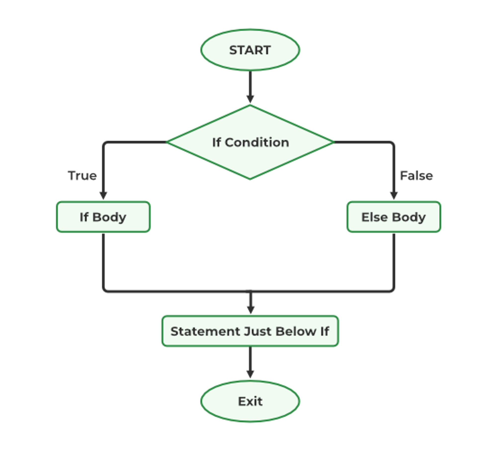

# If - else
The if statement alone tells us that if a condition is true it will execute a block of statements and if the condition is false it won’t. But what if we want to do something else when the condition is false? Here comes the C else statement. We can use the else statement with the if statement to execute a block of code when the condition is false. The if-else statement consists of two blocks, one for false expression and one for true expression.

## Syntax
```
if (condition) {
    // Executes this block if
    // condition is true
}
else {
    // Executes this block if
    // condition is false
}

```

## Flow chart


## Example
```C
// C program to illustrate If statement 
#include <stdio.h> 

int main() 
{ 
	int i = 20; 

	if (i < 15) { 

		printf("i is smaller than 15"); 
	} 
	else { 

		printf("i is greater than 15"); 
	} 
	return 0; 
}


```