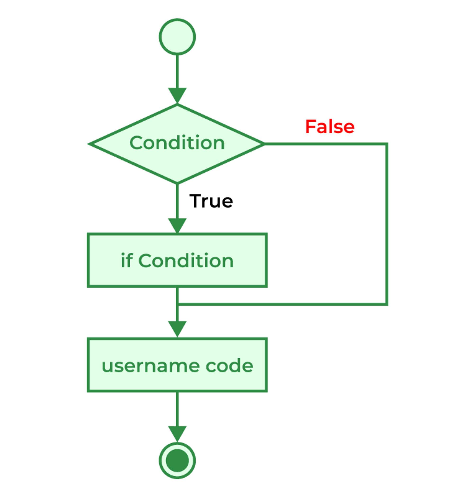

# If
The if statement is the most simple decision-making statement. It is used to decide whether a certain statement or block of statements will be executed or not i.e if a certain condition is true then a block of statements is executed otherwise not.

## Syntax of if Statement
```
if(condition)
{
// Statements to execute if
   // condition is true
}
```

## Flow chart


```C
// C program to illustrate If statement 
#include <stdio.h> 

int main() 
{ 
	int i = 16; 

	if (i > 15) { 
		printf("10 is greater than 15"); 
	} 

	printf("I am Not in if"); 
}


```