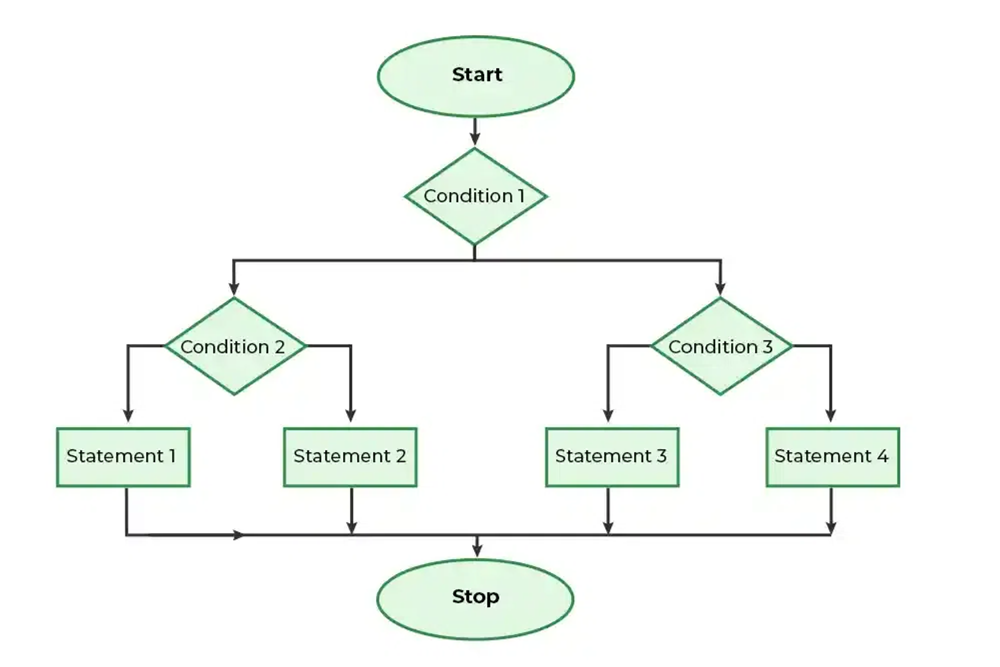

# Nested if else
A nested if in C is an if statement that is the target of another if statement. Nested if statements mean an if statement inside another if statement. Yes, C allow us to nested if statements within if statements, i.e, we can place an if statement inside another if statement.

## Syntax
```
if (condition1) {
   // Executes when condition1 is true
   if (condition2) {
      // Executes when condition2 is true
   } else {
         // Executes when condition2 is false
    }
}
```

## Flow chart


## Example

```C
// C program to illustrate nested-if statement 
#include <stdio.h> 

int main() 
{ 
	int i = 10; 

	if (i == 10) { 
		// First if statement 
		if (i < 15) 
			printf("i is smaller than 15\n"); 

		// Nested - if statement 
		// Will only be executed if statement above 
		// is true 
		if (i < 12) 
			printf("i is smaller than 12 too\n"); 
		else
			printf("i is greater than 15"); 
	} 

	return 0; 
}


```