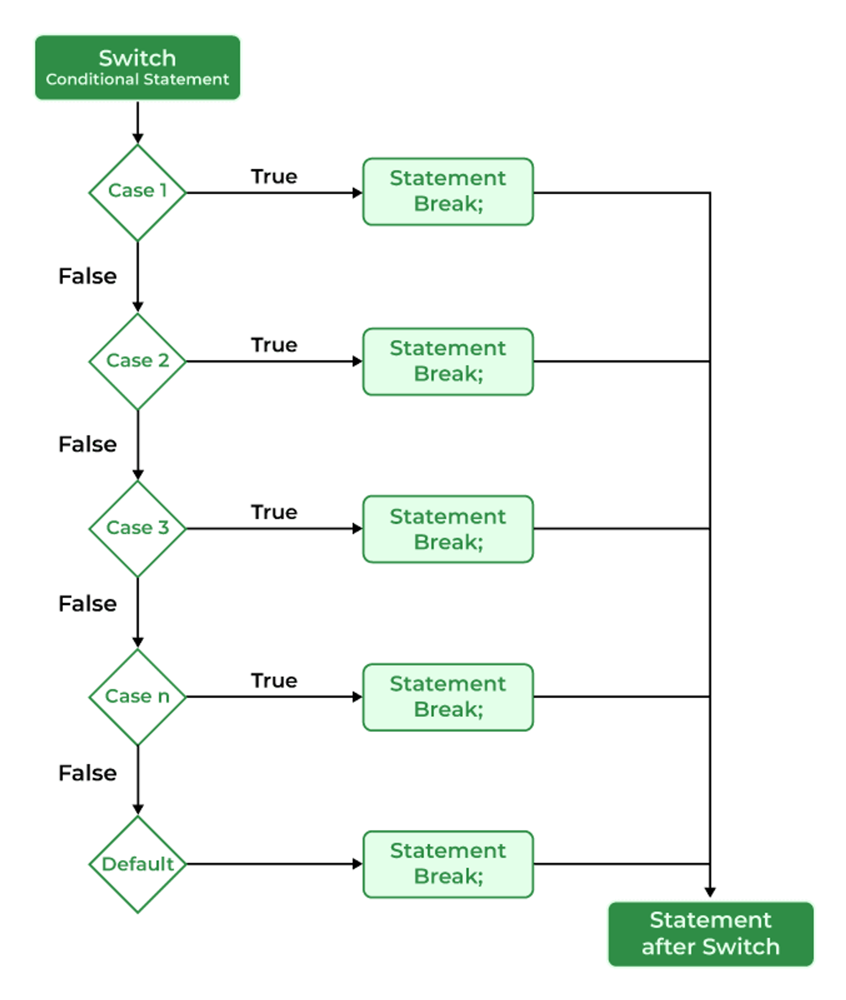

# switch Statement in C
The switch case statement is an alternative to the if else if ladder that can be used to execute the conditional code based on the value of the variable specified in the switch statement. The switch block consists of cases to be executed based on the value of the switch variable.

## Syntax
```
switch (expression) {
    case value1:
        statements;
    case value2:
        statements;
    ....
    ....
    ....
    default:
        statements;
}

```

## FLowchart
